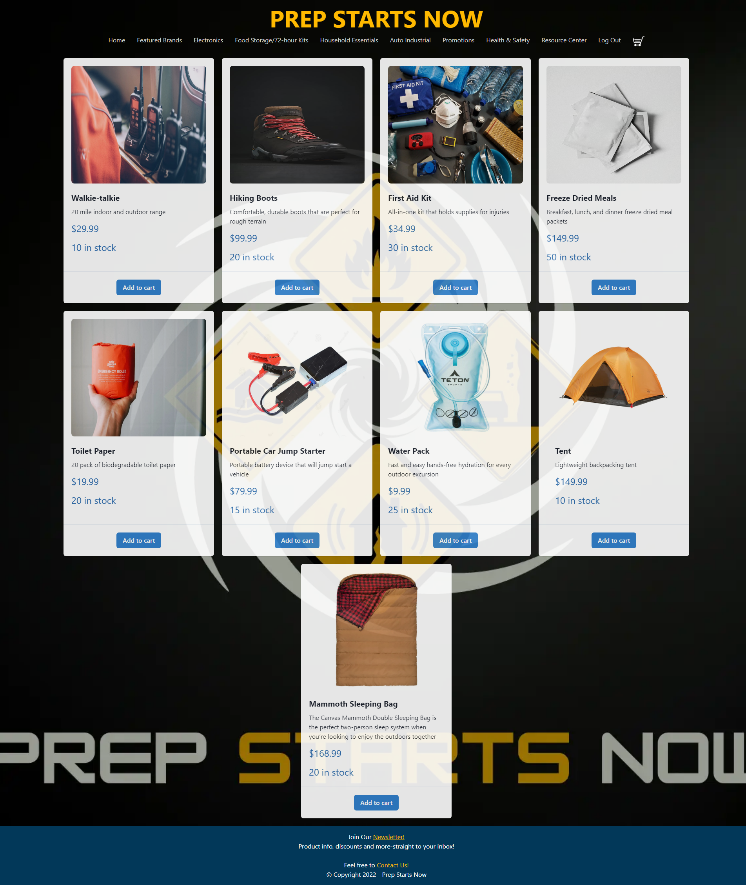

# Prep Starts Now

## Description
Prep Starts Now is an e-commerce site that uses queries and mutations for retrieving, adding, updating, and deleting the products in the shopping cart. The site is responsive, interactive, and protects sensitive API key information on the server. The purpose of the site is to help provide individuals and families with the supplies they would need to prepare for an emergency. 

## User Story

`As a user, I want to shop for emergency preparedness essentials.` 
`When I am shopping, I can view all items, prices, and the amount in stock.` 
`When I click on an item, I can view the item description and price.` 
`When I click 'Add to cart' on an item, the item is sent to my cart.` 
`When I click on the cart icon, I can edit the item quantity or delete an item.` 
`When I am done shopping, I will need to log-in or sign-up on order to check-out.` 
`Once I am logged-in, I can click 'Checkout' and enter my payment information.` 

## Technologies Used

* React for the front end
* GraphQL
* Node.js and Express.js server
* MongoDB
* Mongoose ODM for the database
* Hosted on Heroku
* Authenticated with JWT
* Chakra UI

## Future Development
* Include 'My Account' page that shows user account details

## Contributor GitHubs

* [Ben Bushman](https://github.com/benbushman98)
* [Sarah Randall](https://github.com/srandall1213)
* [Thomas Holmes](https://github.com/ThomasHolmes00)
* [Treavor Wills](https://github.com/treavorwills)
* [Dina Brady](https://github.com/DinaLo44)

## Application Appearance

## Deployed Link
https://prep-starts-now.herokuapp.com/

## Image Credits

* [Radio Image](https://www.pexels.com/photo/close-up-shot-of-walkie-talkies-5733665/)
* [Boots Image](https://www.pexels.com/photo/male-boot-for-wearing-in-winter-or-traveling-4314204/)
* [Toilet Paper Image](https://www.pexels.com/photo/person-holding-red-toilet-paper-3964141/)
* [Car Jump Image](https://www.dreamstime.com/portable-car-jump-start-portable-car-jump-start-isolated-white-background-image140925724)
* [Water Pack Image](https://tetonsports.com/products/2-liter-hydration-bladder-1)
* [Tent Image](https://tetonsports.com/products/mountain-ultra-4-person-tent)
* [First Aid Kit Image](https://www.pexels.com/photo/first-aid-and-surival-kits-5125690/)
* [Sleeping Bag Image](https://tetonsports.com/products/canvas-20-f-mammoth-double-sleeping-bag)

